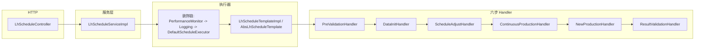

# aps-lh-parent 系统设计概要

> 本文档描述当前仓库内「硫化（LH）自动排程」服务的结构与关键行为，供需求讨论、方案评审与迭代时对照代码使用。  
> **维护约定**：模块职责、主流程或对外接口变更时，应同步更新本节对应段落。

---

## 1. 项目定位与模块划分

| 模块 | 说明 |
|------|------|
| `aps-lh-api` | 对外契约：DTO、上下文、实体、枚举、常量等，供实现模块与其它调用方依赖 |
| `aps-lh` | Spring Boot 实现：REST、MyBatis-Plus 持久化、排程引擎、Redis 批次号、事件发布 |

父 POM 统一：Java 8、Spring Boot 2.7.18、MyBatis-Plus 3.5.3、MySQL、Spring Data Redis（Lettuce）、Swagger 2.9。

---

## 2. 对外接口（HTTP）

| 方法 | 路径 | 职责 |
|------|------|------|
| `POST` | `/lh/schedule/execute` | 执行自动排程，请求体为 `LhScheduleRequestDTO` |
| `POST` | `/lh/schedule/publish/{batchNo}` | 将某批次排程结果标记为已发布，并发布「已发布」事件（供对接 MES 等） |

Swagger：`springfox`，标签「硫化排程接口」。

---

## 3. 排程主链路（从请求到落库）

- **入口**：`LhScheduleServiceImpl#executeSchedule` 根据请求构建 `LhScheduleContext`，调用注入的 `IScheduleExecutor`（由 `ScheduleExecutorConfig` 提供带 `@Primary` 的装饰器链：`PerformanceMonitorDecorator` → `LoggingScheduleDecorator` → `DefaultScheduleExecutor`）。
- **骨架**：`DefaultScheduleExecutor` 委托 `AbsLhScheduleTemplate#execute`；具体步骤由 `LhScheduleTemplateImpl` 分别委托六个 `*Handler`。
- **中断语义**：各步可通过上下文 `interruptSchedule` 中断；模板在每步后检查 `context.isInterrupted()`，提前返回失败响应。
- **异常**：模板 `catch` 后返回 `LhScheduleResponseDTO.fail(...)`，并记录当前步骤。

---

## 4. 排程目标日与 T 日（时间轴）

与业务文档中的「目标日 / 连续排程窗口」一致，代码约定如下（见 `LhScheduleServiceImpl#buildContext` 与 `LhScheduleContext` 注释）：

- **`scheduleDate`（请求体 `scheduleDate`）**：视为 **排程目标日**（如业务上的 T+2 对应日期）。
- **`scheduleDate`（上下文内引擎用 T 日）**：**排程窗口起点** = 目标日 − (`LhScheduleConstant.SCHEDULE_DAYS` − 1)。当前 `SCHEDULE_DAYS = 3`，即窗口为连续 3 个日历日，共 9 个班次（`TOTAL_SHIFTS`）。

引擎内班次、基础数据加载等以该 **T 日起算的时间轴** 为准；请求参数名仍为 `scheduleDate`，含义是「目标日」，避免与旧文档混淆时可在此文档与 API 说明中显式写明。

---

## 5. 六步流程（S4.1～S4.6）

与 `ScheduleStepEnum`、`AbsLhScheduleTemplate` 注释一致：

| 步骤 | 处理器 | 概要 |
|------|--------|------|
| S4.1 | `PreValidationHandler` | MES 下发状态校验、是否重复排程、历史数据清理、**生成批次号**（Redis）等 |
| S4.2 | `DataInitHandler` | 加载月计划、工作日历、产能、机台、模具关系等基础数据至上下文 |
| S4.3 | `ScheduleAdjustHandler` | 排程调整与 SKU 归集（续作 / 新增分流的前置数据） |
| S4.4 | `ContinuousProductionHandler` | 续作规格排产 |
| S4.5 | `NewProductionHandler` | 新增规格排产 |
| S4.6 | `ResultValidationHandler` | 结果校验、持久化、必要时发布事件 |

S4.1 中批次号由 `LhBatchNoRedisGenerator` 生成：格式 `LHPC` + `yyyyMMdd` + 流水（Redis key 按厂、按日隔离，首次递增时设置 24 小时 TTL）。

---

## 6. 基础数据与策略扩展

- **基础数据加载**：`ILhBaseDataService` / `LhBaseDataServiceImpl` 集中封装多表查询与组装；各 Handler 通过上下文读取 Map/List。
- **校验链**：`engine/chain/validators` 下校验器（如月计划、SKU 产能、模具关系）可在前置或各步中组合使用（以实际调用为准）。
- **策略**：`engine/strategy` 与 `ScheduleStrategyFactory` 等用于试制、连续/新增排产、机台匹配等可替换逻辑。
- **常量**：业务阈值、班次、换模、清洗、胶囊等默认值集中在 `LhScheduleConstant`，修改排程窗口或业务规则时优先查此类。

---

## 7. 发布流程与事件

- `publishSchedule(batchNo)`：按批次号查询 `LhScheduleResult`，批量更新发布状态（如 `isRelease = 1`），构造 `LhScheduleContext` 后调用 `ScheduleEventPublisher.publish(ScheduleEvent.published(...))`。
- `ScheduleEventPublisher` 注入所有 `IScheduleEventListener` 实现；按 `supports(eventType)` 分发，**单个监听器异常不影响其它监听器**（内部 try/catch 记日志）。

新增下游集成时，通常增加监听器实现并注册为 Spring Bean 即可。

---

## 8. 持久化与包结构速查

- **Mapper**：`com.zlt.aps.lh.mapper`，与 MyBatis-Plus 配合；实体定义多在 `aps-lh-api`。
- **结果与过程数据**：如 `LhScheduleResult`、未排产结果、换模计划、过程日志等表由对应 Mapper 维护（详见各 Handler / Service）。

---

## 9. 配置与运行注意点

- **Redis**：批次号强依赖原子自增；不可用时会触发 `IllegalStateException` 等，需保证 Redis 可达。
- **数据库**：连接信息在 `aps-lh` 的 Spring 配置中（如 `application.yml` / `application-*.yml`），部署时按环境覆盖。
- **并发与重复排程**：S4.1 含「是否正在排程」等校验，具体规则以 `PreValidationHandler` 实现为准。

---

## 10. 后续文档建议

- 若采用 Superpowers 等流程产出正式规格，可在 `docs/superpowers/specs/` 下按日期归档专题设计，并在本文件「维护约定」中增加交叉引用链接。
- API 字段语义（尤其日期字段）建议在 Swagger 注解或独立 `API.md` 中与本文第 4 节保持一致。

---

*文档版本：与仓库代码同步维护；最后整理基于模块 `aps-lh` / `aps-lh-api` 当前包结构与公开类职责。*
