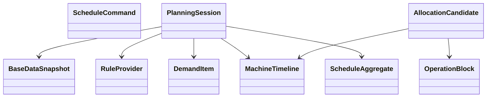
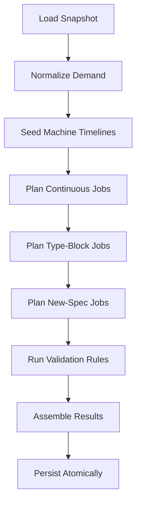

# 硫化排程内核重构设计：从 `Context/Handler/Strategy` 到可扩展引擎

> 目标不是换一层名字，而是把当前“巨型共享上下文 + 大颗粒策略类”的排程脚本，重构成一个可验证、可回放、可扩展的排程引擎。

## 1. 设计目标

- 机台时间线必须闭环，任何时候一台机只能处于一种占用状态。
- 规则扩展应当是“新增一个约束/评分器/分配器”，而不是“改 5 个类补 if”。
- 基础数据要快照化，排程过程要可回放。
- 计算过程与最终持久化解耦，最后再做原子替换。
- 保留现有系统已经做对的外层骨架，不做整套推翻。

## 2. 哪些保留，哪些替换

### 保留

- `Controller -> Service -> Executor -> Template` 外层链路。
- `Decorator` 做日志、性能监控。
- `ScheduleEventPublisher` 做完成/发布事件。

### 替换

- `LhScheduleContext` 这个巨型共享可变对象。
- `Handler` 里“加载数据 + 改状态 + 写结果 + 调多策略”的混合职责。
- `IProductionStrategy` 这种把“续作”和“新增”都塞在同一个接口里的大颗粒设计。
- `ScheduleStrategyFactory` 这种“能注册很多策略，但实际边界不清晰”的入口。

## 3. 新的内核分层


### 3.1 输入层：`ScheduleCommand`

只承载“这次排程请求是什么”：

- `factoryCode`
- `scheduleTargetDate`
- `monthPlanVersion`
- `productionVersion`
- `operator`
- `requestId`

它是请求对象，不承载中间态。

### 3.2 只读快照层：`BaseDataSnapshot`

把当前 `DataInitHandler` 塞进 `LhScheduleContext` 的那些大 Map，收束成一个只读快照对象：

- `monthPlans`
- `workCalendars`
- `machineInfos`
- `machineOnlineInfos`
- `skuCapacities`
- `skuMouldRelations`
- `cleaningPlans`
- `shutdownPlans`
- `maintenancePlans`
- `previousResults`
- `shiftFinishQty`
- `materialInfos`

**关键约束：**

- 快照创建完成后不可变。
- 全部规则都只能读快照，不能在快照上偷偷写状态。

### 3.3 规则层：`RuleProvider`

统一提供所有规则来源：

- 数值参数来自 `LhParams`
- 固定默认值来自常量
- 必要时支持按工厂、按日期、按班次解析

对内只暴露强类型规则对象，例如：

- `MouldChangeRules`
- `InspectionRules`
- `EndingRules`
- `PriorityRules`
- `ShiftCalendarRules`

这里的重点不是“再造一个规则引擎”，而是先消灭三套来源并存的问题。

### 3.4 可变会话层：`PlanningSession`

`PlanningSession` 是唯一允许持有中间态的对象，但它不再是随便放字段的“公共大包”。

它只管理四类状态：

- `DemandPool`
- `MachineTimelineBook`
- `ScheduleAggregate`
- `PlanningDiagnostics`

#### `DemandPool`

负责当前轮待排需求：

- 续作需求
- 换活字块需求
- 新增规格需求
- 欠产/超产传导后的净需求

#### `MachineTimelineBook`

负责所有机台的时间线状态，每台机一个聚合根：

- `MachineTimeline`
- `nextAvailableTime`
- `currentSpec`
- `currentMaterial`
- `occupiedMoulds`
- `plannedBlocks`

#### `ScheduleAggregate`

负责最终输出：

- `scheduleResults`
- `unscheduledResults`
- `mouldChangePlans`
- `processLogs`

#### `PlanningDiagnostics`

负责解释性信息：

- 候选机台过滤原因
- 未排原因
- 规则命中情况
- 每一步决策日志

## 4. 核心对象模型



### 4.1 `DemandItem`

统一表达一条待排需求，不再用“续作一个 DTO、新增一个分支逻辑”硬拆：

- `demandType`: `CONTINUOUS / TYPE_BLOCK_CHANGE / NEW_SPEC`
- `materialCode`
- `specCode`
- `requiredQty`
- `priority`
- `dueRisk`
- `endingFlag`
- `sourceVersion`

### 4.2 `MachineTimeline`

`MachineTimeline` 是新内核的核心。

它不只存“当前状态”，而是存“这台机从什么时候到什么时候被什么占用”。

建议 block 类型至少包括：

- `CONTINUOUS_PRODUCTION`
- `TYPE_BLOCK_CHANGE`
- `MOULD_CHANGE`
- `FIRST_INSPECTION`
- `NEW_SPEC_PRODUCTION`
- `CLEANING`
- `MAINTENANCE`
- `REPAIR`
- `SHUTDOWN`

这样新增规则时，优先考虑的是“加一个 block 类型或约束”，而不是改多个 if。

### 4.3 `AllocationCandidate`

候选方案不再只是“选哪台机”，而是完整方案：

- 哪台机
- 从什么时候开始换模
- 首检在哪个班
- 什么时候开产
- 本次会占哪些模具
- 什么时候结束
- 为什么它比别的候选更优

## 5. 用 `Stage + Constraint + Scorer + Allocator` 替换大颗粒 `Handler/Strategy`

### 5.1 新的 Stage 只做流程编排

新的 `Stage` 只表达流程边界，不直接塞业务细节：

- `ExecutionGuardStage`
- `SnapshotLoadStage`
- `DemandPrepareStage`
- `PlanningStage`
- `ValidationStage`
- `PersistenceStage`
- `PublishStage`

每个 Stage 只做一件事，并且只通过 `PlanningSession` 的受控 API 写状态。

### 5.2 把现有 Strategy 拆成 4 类插件点

#### `CandidateConstraint`

负责过滤不可行候选：

- 定点机台限制
- 寸口范围
- 模具共用冲突
- 夜班禁换模
- 维修/保养/清洗占用

#### `CandidateScorer`

负责给可行候选打分：

- 同规格优先
- 相近英寸优先
- 胶囊使用均衡
- 最早完成优先
- 换模成本最小优先

#### `OperationPlanner`

负责把一条需求展开成时间块：

- 续作：直接生产块
- 换活字块：首检块 + 生产块
- 新增规格：换模块 + 首检块 + 生产块

#### `PostAllocationPolicy`

负责分配后的补偿规则：

- 胎胚库存扣减
- 欠产/超产回写
- 收尾标记
- 交替计划生成

## 6. 新引擎下的排程主流程



### 6.1 `Normalize Demand`

把当前散落在 `ScheduleAdjustHandler` 里的动作收束成一个阶段：

- 读取月计划
- 计算余量
- 合并欠产/超产传导
- 标记收尾
- 产出 `DemandItem`

### 6.2 `Seed Machine Timelines`

把当前机台状态初始化真正做完整：

- 当前在机规格
- 上一规格画像
- 前日收尾时间
- 已知停机/保养/维修/清洗块
- 已占用模具

### 6.3 `Plan Jobs`

所有需求都走统一求解框架：

1. 生成候选机台方案
2. 用 `Constraint` 过滤
3. 用 `Scorer` 排序
4. 选择最优候选
5. 在 `MachineTimeline` 上一次性预留 block
6. 更新需求剩余量和输出聚合

这一步最重要的变化是：**先产出完整候选方案，再落时间线，而不是边算边改共享上下文。**

## 7. 持久化与发布边界

### 7.1 持久化

新内核的持久化原则很简单：

- 排程期间只改内存态，不删数据库旧数据。
- 最终由 `SchedulePersistenceService` 在一个事务里做原子替换。
- 持久化只接受 `ScheduleAggregate`，不直接接触规划中间态。

### 7.2 发布

- 发布动作要在持久化提交后再做。
- 更稳妥的做法是走 after-commit 事件或 outbox。
- 这样即使下游通知失败，也不会影响主事务数据正确性。

## 8. 包结构建议

| 包 | 职责 | 取代当前什么 |
|----|------|--------------|
| `engine/application` | 服务编排、执行入口 | `LhScheduleServiceImpl` 的核心编排部分 |
| `engine/snapshot` | 基础数据加载与快照构建 | `DataInitHandler` + `BaseDataService` 的一部分 |
| `engine/rules` | 规则提供与解析 | `LhParams + 常量 + 零散工具类` |
| `engine/session` | 会话态、需求池、诊断信息 | `LhScheduleContext` 的中间态部分 |
| `engine/timeline` | 机台时间线、block 预留 | `MachineScheduleDTO + 部分 strategy 状态` |
| `engine/planner` | 约束、评分、分配器 | `Handler + StrategyFactory + Strategy` 的核心逻辑 |
| `engine/assembler` | 结果组装 | `ResultValidationHandler` 的前半段 |
| `engine/persistence` | 原子替换落库 | `PreValidationHandler + ResultValidationHandler` 的持久化部分 |

## 9. 现有类到新模型的映射

| 当前类 | 新角色 |
|--------|--------|
| `LhScheduleContext` | 拆为 `ScheduleCommand + BaseDataSnapshot + PlanningSession + ScheduleAggregate` |
| `PreValidationHandler` | `ExecutionGuardStage` |
| `DataInitHandler` | `SnapshotLoadStage` |
| `ScheduleAdjustHandler` | `DemandPrepareStage` |
| `ContinuousProductionHandler` + `NewProductionHandler` | `PlanningStage` |
| `ContinuousProductionStrategy` + `NewSpecProductionStrategy` | `OperationPlanner + Constraint + Scorer + PostAllocationPolicy` |
| `ResultValidationHandler` | `ValidationStage + PersistenceStage + Assembler` |

## 10. 为什么这个设计更可扩展

- 新增一个规则时，优先是“加一个约束器/评分器”，不是改共享上下文字段。
- 新增一种机台事件时，优先是“加一个时间块类型”，不是改多处时间计算。
- 回放一次排程时，只需要 `ScheduleCommand + BaseDataSnapshot + RuleSet`，不需要猜上下文在哪一步被谁改过。
- 测试时可以直接测：
  - 某个 `Constraint`
  - 某个 `Scorer`
  - 某个 `OperationPlanner`
  - 某条 `MachineTimeline`

## 11. 迁移路线：不要大爆炸重写

### 阶段 1：先把壳子立住

- 引入 `ScheduleCommand / BaseDataSnapshot / PlanningSession / ScheduleAggregate`
- 现有 Handler 先变成新对象的适配层
- 先不动对外接口

### 阶段 2：先迁新增规格排产

- 因为新增规格是当前最容易错时序的部分
- 先让 `NewSpecProductionStrategy` 退役，改由 `MachineTimeline + OperationPlanner` 承接

### 阶段 3：再迁续作与欠产规则

- 把 `ContinuousProductionStrategy` 的逻辑拆进统一 planner
- 让续作、换活字块、新增规格都走同一套候选求解框架

### 阶段 4：最后移除旧 Context 和旧 StrategyFactory

- 当所有主链逻辑都迁完后，再删旧实现
- 这样每一步都能保持系统可运行、可回归

## 12. 推荐先落地的第一批代码骨架

```java
public interface PlanningStage {
    void execute(PlanningSession session);
}

public interface CandidateConstraint {
    boolean test(PlanningSession session, AllocationCandidate candidate);
}

public interface CandidateScorer {
    int score(PlanningSession session, AllocationCandidate candidate);
}

public interface OperationPlanner {
    List<OperationBlock> plan(PlanningSession session, DemandItem demand, MachineTimeline machine);
}
```

第一批只要把这些骨架立起来，新内核就已经有了明确边界。后面每加一条规则，都能沿着统一接口扩展，而不是继续把 `Context` 撑大。
