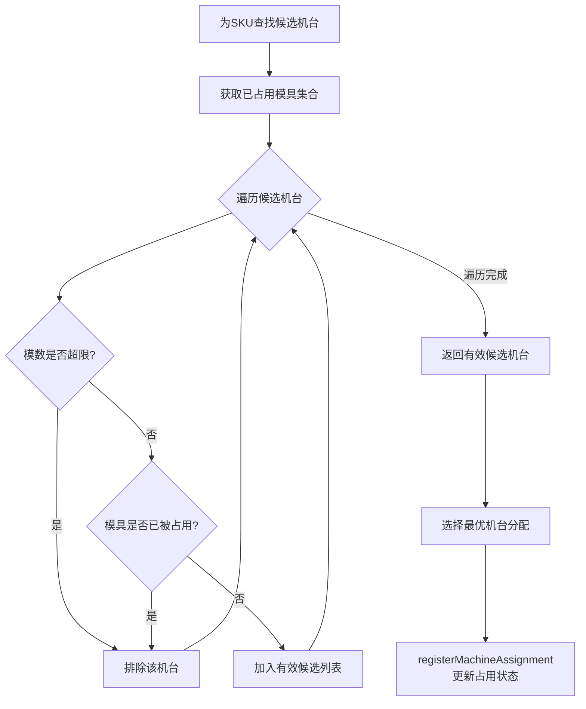

# 共用模约束实现架构

## 概述

硫化排程项目中实现了完整的**共用模具约束机制**，确保同一模具在同一时间段只能分配给一台硫化机，防止模具资源冲突。

---

## 1. 核心约束检查

### 1.1 获取已占用模具集合

**文件位置**：`aps-lh/src/main/java/com/zlt/aps/lh/engine/strategy/impl/DefaultMachineMatchStrategy.java`

```java
/**
 * 获取当前所有已分配排程中正在使用的模具号集合（共用模保护）
 */
private Set<String> getOccupiedMouldCodes(LhScheduleContext context) {
    Set<String> occupied = new HashSet<>();
    for (Map.Entry<String, List<LhScheduleResult>> entry : context.getMachineAssignmentMap().entrySet()) {
        for (LhScheduleResult result : entry.getValue()) {
            if (result.getMouldCode() != null) {
                occupied.add(result.getMouldCode());
            }
        }
    }
    return occupied;
}
```

**功能说明**：
- 遍历 `machineAssignmentMap` 中所有机台的所有排程结果
- 提取每个排程结果中的模具号
- 返回当前已被占用的模具号集合

### 1.2 模具兼容性检查

```java
/**
 * 检查模具是否与机台兼容（模数不超限且模具未被占用）
 */
private boolean isMouldCompatible(List<String> skuMouldCodes, MachineScheduleDTO machine, Set<String> occupiedMouldCodes) {
    if (skuMouldCodes.isEmpty()) {
        return true;
    }
    // 模数不能超过机台最大模台数
    if (skuMouldCodes.size() > machine.getMaxMoldNum()) {
        return false;
    }
    // 检查模具是否已被占用（共用模冲突）
    for (String mouldCode : skuMouldCodes) {
        if (occupiedMouldCodes.contains(mouldCode)) {
            return false;  // 模具已被其他机台使用，排除该机台
        }
    }
    return true;
}
```

**检查逻辑**：
1. **模数限制**：SKU所需模具数量不能超过机台最大模台数
2. **共用模冲突**：SKU的任一模具号已被占用，则该机台不可用

---

## 2. 约束检查流程

```
┌─────────────────────────────────────────────────────────────────┐
│                      排程执行流程                                │
├─────────────────────────────────────────────────────────────────┤
│                                                                 │
│  1. 为SKU查找候选机台                                            │
│     ↓                                                           │
│  2. getOccupiedMouldCodes() - 获取所有已分配排程的模具号集合        │
│     ↓                                                           │
│  3. isMouldCompatible() - 逐一检查候选机台                        │
│     • 模数是否超限？                                              │
│     • 模具是否已被占用？（共用模冲突检查）                          │
│     ↓                                                           │
│  4. 排除不兼容机台，返回有效候选列表                               │
│     ↓                                                           │
│  5. 分配成功后 → registerMachineAssignment() 更新占用状态          │
│                                                                 │
└─────────────────────────────────────────────────────────────────┘
```

### 流程图（Mermaid）



---

## 3. 数据支撑体系

### 3.1 核心数据结构

| 组件 | 文件位置 | 作用 |
|------|----------|------|
| `MdmSkuMouldRel` | `aps-lh-api/.../entity/MdmSkuMouldRel.java` | SKU与模具关系实体，包含`shareMouldCode`共用模具号字段 |
| `machineAssignmentMap` | `LhScheduleContext` | `Map<机台编码, List<排程结果>>`，实时维护模具占用状态 |
| `skuMouldRelMap` | `LhScheduleContext` | `Map<物料编码, List<SKU模具关系>>`，SKU模具映射 |
| `LhScheduleResult.mouldCode` | `aps-lh-api/.../entity/LhScheduleResult.java` | 排程结果中记录使用的模具号（多个以逗号分隔） |

### 3.2 SKU与模具关系实体

**文件位置**：`aps-lh-api/src/main/java/com/zlt/aps/mdm/api/domain/entity/MdmSkuMouldRel.java`

```java
/**
 * 共用模具号
 */
@Excel(name = "ui.data.column.relation.shareMouldCode")
@ApiModelProperty(value = "共用模具号", name = "shareMouldCode")
@TableField(value = "SHARE_MOULD_CODE")
private String shareMouldCode;

/**
 * 是否共用花纹/侧板块
 */
@ApiModelProperty(value = "是否共用花纹/侧板块，字典：biz_yes_no，0否1是")
@TableField(value = "IS_SAME_PATTER_PANEL")
private String isSamePatterPanel;
```

### 3.3 机台分配注册

**文件位置**：`aps-lh/src/main/java/com/zlt/aps/lh/engine/strategy/impl/ContinuousProductionStrategy.java`

```java
private void registerMachineAssignment(LhScheduleContext context, String machineCode, LhScheduleResult result) {
    context.getMachineAssignmentMap()
            .computeIfAbsent(machineCode, k -> new ArrayList<>())
            .add(result);
}
```

**作用**：每次排程分配成功后，立即将排程结果注册到`machineAssignmentMap`，确保后续约束检查能获取到最新的模具占用状态。

---

## 4. 前置数据校验

### 4.1 模具关系校验器

**文件位置**：`aps-lh/src/main/java/com/zlt/aps/lh/engine/chain/validators/MouldRelationValidator.java`

```java
@Slf4j
@Component
public class MouldRelationValidator implements IDataValidator {

    @Override
    public boolean validate(LhScheduleContext context) {
        // 检查SKU模具关系数据是否为空
        if (context.getSkuMouldRelMap() == null || context.getSkuMouldRelMap().isEmpty()) {
            log.warn("SKU与模具关系数据为空, 工厂: {}", context.getFactoryCode());
            context.addValidationError("[" + getValidatorName() + "] SKU与模具关系数据为空");
            return false;
        }
        
        // 检查月计划中的SKU是否都有模具关系数据
        long missingMouldCount = context.getMonthPlanList().stream()
                .filter(p -> p.getMaterialCode() != null
                        && !context.getSkuMouldRelMap().containsKey(p.getMaterialCode()))
                .count();
        if (missingMouldCount > 0) {
            log.warn("有{}个月计划SKU缺少模具关系数据", missingMouldCount);
            return false;
        }
        
        log.info("模具关系校验通过, SKU模具关系数: {}", context.getSkuMouldRelMap().size());
        return true;
    }

    @Override
    public String getValidatorName() {
        return "SKU与模具关系校验";
    }
}
```

**校验时机**：在排程执行前的数据初始化阶段进行校验，确保所有待排程SKU都有对应的模具关系数据。

---

## 5. 模具数据加载

**文件位置**：`aps-lh/src/main/java/com/zlt/aps/lh/service/impl/LhBaseDataServiceImpl.java`

```java
private void loadSkuMouldRel(LhScheduleContext context, String factoryCode) {
    List<MdmSkuMouldRel> skuMouldRelList = skuMouldRelMapper.selectList(
            new LambdaQueryWrapper<MdmSkuMouldRel>()
                    .eq(MdmSkuMouldRel::getFactoryCode, factoryCode)
                    .eq(MdmSkuMouldRel::getIsDelete, DeleteFlagEnum.NORMAL.getCode()));
    
    Map<String, List<MdmSkuMouldRel>> skuMouldRelMap = new HashMap<>(64);
    if (skuMouldRelList != null) {
        for (MdmSkuMouldRel rel : skuMouldRelList) {
            if (rel.getMaterialCode() != null) {
                skuMouldRelMap.computeIfAbsent(rel.getMaterialCode(), k -> new ArrayList<>()).add(rel);
            }
        }
    }
    context.setSkuMouldRelMap(skuMouldRelMap);
    log.debug("SKU与模具关系加载完成, SKU数量: {}", skuMouldRelMap.size());
}
```

**说明**：支持一个SKU对应多个模具的关系（一对多），通过`computeIfAbsent`实现分组。

---

## 6. 续作场景的模具兼容检查

**文件位置**：`aps-lh/src/main/java/com/zlt/aps/lh/engine/strategy/impl/ContinuousProductionStrategy.java`

```java
/**
 * 验证SKU模具与机台当前模具是否兼容（同模具换活字块）
 */
private boolean isMouldCompatible(LhScheduleContext context, SkuScheduleDTO sku, MachineScheduleDTO machine) {
    List<MdmSkuMouldRel> mouldRels = context.getSkuMouldRelMap().get(sku.getMaterialCode());
    if (mouldRels == null || mouldRels.isEmpty()) {
        return false;
    }
    List<MdmSkuMouldRel> machineMoulds = context.getSkuMouldRelMap().get(machine.getCurrentMaterialCode());
    if (machineMoulds == null || machineMoulds.isEmpty()) {
        return false;
    }
    // 检查是否有相同的模具号（可以换活字块而不用换模）
    for (MdmSkuMouldRel rel : mouldRels) {
        for (MdmSkuMouldRel machineRel : machineMoulds) {
            if (rel.getMouldCode() != null && rel.getMouldCode().equals(machineRel.getMouldCode())) {
                return true;
            }
        }
    }
    return false;
}
```

**应用场景**：续作排产时，判断新SKU是否可以复用机台当前的模具（仅需换活字块），避免完整换模。

---

## 7. 模具交替计划生成

**文件位置**：`aps-lh/src/main/java/com/zlt/aps/lh/handler/ResultValidationHandler.java`

```java
private void generateMouldChangePlan(LhScheduleContext context) {
    log.info("生成模具交替计划, 换模排程结果数: {}",
            context.getScheduleResultList().stream().filter(r -> "1".equals(r.getIsChangeMould())).count());

    List<LhMouldChangePlan> plans = context.getMouldChangePlanList();
    int planOrder = 1;

    for (LhScheduleResult result : context.getScheduleResultList()) {
        if (!"1".equals(result.getIsChangeMould())) {
            continue;
        }

        LhMouldChangePlan plan = new LhMouldChangePlan();
        plan.setFactoryCode(context.getFactoryCode());
        plan.setLhResultBatchNo(context.getBatchNo());
        plan.setScheduleDate(context.getScheduleTargetDate());
        plan.setLhMachineCode(result.getLhMachineCode());
        plan.setAfterMaterialCode(result.getMaterialCode());
        plan.setMouldCode(result.getMouldCode());
        
        // 判断交替类型：01-正规换模、02-更换活字块、03-喷砂清洗、04-干冰清洗
        plan.setChangeMouldType(determineChangeMouldType(result));
        plans.add(plan);
    }
}
```

---

## 8. 设计特点总结

| 特点 | 说明 |
|------|------|
| **动态更新** | 每次排程分配后立即调用`registerMachineAssignment()`更新占用状态 |
| **全局视角** | 遍历`machineAssignmentMap`中所有机台的所有排程结果，确保无遗漏 |
| **多层防护** | 基础数据校验 → 机台匹配 → 排程结果保存，形成完整防护链 |
| **一对多支持** | SKU与模具为一对多关系，支持同一SKU使用多套模具的场景 |
| **实时追踪** | 排程结果中明确记录模具号，便于后续模具交替计划生成和执行追踪 |

---

## 9. 相关文件索引

| 文件 | 路径 | 职责 |
|------|------|------|
| DefaultMachineMatchStrategy | `aps-lh/.../engine/strategy/impl/` | 共用模冲突检查核心实现 |
| ContinuousProductionStrategy | `aps-lh/.../engine/strategy/impl/` | 续作场景模具兼容检查 |
| NewSpecProductionStrategy | `aps-lh/.../engine/strategy/impl/` | 新增规格排产，含模具分配 |
| MouldRelationValidator | `aps-lh/.../engine/chain/validators/` | 模具关系前置校验 |
| LhBaseDataServiceImpl | `aps-lh/.../service/impl/` | SKU模具关系数据加载 |
| ResultValidationHandler | `aps-lh/.../handler/` | 模具交替计划生成 |
| MdmSkuMouldRel | `aps-lh-api/.../entity/` | SKU与模具关系实体 |
| LhScheduleResult | `aps-lh-api/.../entity/` | 排程结果实体（含模具号） |
| LhScheduleContext | `aps-lh-api/.../context/` | 排程上下文，维护机台分配映射 |
