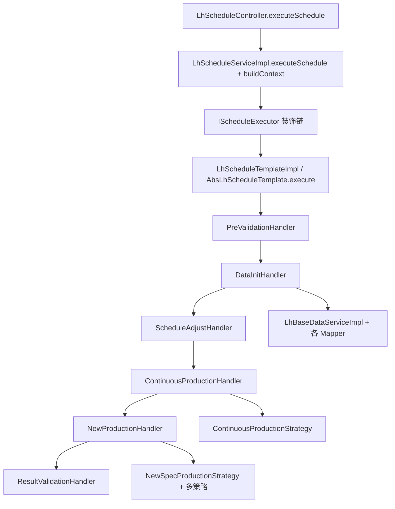

# 硫化排程 `executeSchedule`：调用链与核心逻辑

本文基于仓库源码梳理，便于对照类与方法跳转。

---

## 一、调用链（从 `executeSchedule` 到业务层）

### HTTP 入口

`LhScheduleController#executeSchedule` 接收请求后委托 `ILhScheduleService#executeSchedule`。

### Service：构建上下文 + 委托执行器

`LhScheduleServiceImpl#executeSchedule`：

- 构建 `LhScheduleContext`。
- `buildContext`：`scheduleTargetDate` = 请求日（清零时间）；`scheduleDate`（T 日）= 目标日 − `(SCHEDULE_DAYS-1)`，与 `LhScheduleConstant.SCHEDULE_DAYS=3` 的连续排程窗口一致。
- 调用 `scheduleExecutor.execute(context)`。

### 执行器（Bean 链）

- `@Primary` `decoratedScheduleExecutor`：`PerformanceMonitorDecorator` → `LoggingScheduleDecorator` → `DefaultScheduleExecutor`（`ScheduleExecutorConfig`）。
- `DefaultScheduleExecutor#execute` → `AbsLhScheduleTemplate#execute` 的具体实现类 `LhScheduleTemplateImpl`。

### 模板六步 → Handler（Spring 组件）

| 步骤 | 模板方法 | Handler |
|------|----------|---------|
| S4.1 | `doPreValidation` | `PreValidationHandler` |
| S4.2 | `doDataInitialization` | `DataInitHandler` |
| S4.3 | `doAdjustAndGather` | `ScheduleAdjustHandler` |
| S4.4 | `doContinuousProduction` | `ContinuousProductionHandler` |
| S4.5 | `doNewSpecProduction` | `NewProductionHandler` |
| S4.6 | `doResultValidationAndSave` | `ResultValidationHandler` |

### S4.2 数据层（Mapper / Service）

- `LhParamsMapper`：硫化参数 → `context.lhParamsMap`。
- `ILhBaseDataService#loadAllBaseData`（`LhBaseDataServiceImpl`）顺序调用：`MpFactoryProductionVersionMapper`、`FactoryMonthPlanProductionFinalResultMapper`、`MdmWorkCalendarMapper`、`MdmSkuLhCapacityMapper`、`MdmDevicePlanShutMapper`、`MdmSkuMouldRelMapper`、`LhMachineInfoMapper`、`LhMouldCleanPlanMapper`、`MdmMonthSurplusMapper`、`LhShiftFinishQtyMapper`、`MdmMaterialInfoMapper`、`MdmLhMachineOnlineInfoMapper`（T−1 在机）、`LhSpecifyMachineMapper`、`MdmLhRepairCapsuleMapper`、`MdmDevMaintenancePlanMapper` 等。
- `DataValidationChain#validate`：责任链校验基础数据。

### S4.1 / S4.3 / S4.6 涉及 Mapper

- **PreValidationHandler**：`LhScheduleResultMapper`、`LhUnscheduledResultMapper`、`LhMouldChangePlanMapper`；批次号经 `ILhScheduleResultService`（含 Redis 流水等实现）。
- **ScheduleAdjustHandler**：`LhScheduleResultMapper#selectPreviousSchedule`（前日排程）。
- **ResultValidationHandler**：`LhScheduleResultMapper`、`LhUnscheduledResultMapper`、`LhMouldChangePlanMapper`、`LhScheduleProcessLogMapper`；完成后 `ScheduleEventPublisher.publish(ScheduleEvent.completed)`。

### S4.4 / S4.5 策略层

- `ScheduleStrategyFactory`：`continuousProductionStrategy`（`ContinuousProductionStrategy`）、`newSpecProductionStrategy`（`NewSpecProductionStrategy`）；另注入 `DefaultMachineMatchStrategy`、`DefaultSkuPriorityStrategy`、`DefaultMouldChangeBalanceStrategy`、`DefaultFirstInspectionBalanceStrategy`、`DefaultCapacityCalculateStrategy`。

### 总览图

---

## 二、关键业务逻辑抽取

### 1）排程约束与排产优先级

**新增 SKU 排序**（`DefaultSkuPriorityStrategy`）：交期锁定优先 → 延误天数越大越优先 → 收尾 SKU 优先，且 `endingDaysRemaining` 越大越优先 → 供应链优先级 04→05→06→07。

**机台侧约束**（`DefaultMachineMatchStrategy`）：定点机台白名单（无配置则不限）、机台启用、寸口范围、模具个数 ≤ 机台 `maxMoldNum`、**共用模**：已占用模具不能再分配给其它排程。

**换模 / 首检资源约束**

- `DefaultMouldChangeBalanceStrategy`：日上限默认 15、早班 8、中班 7；20:00–次日 6:00 禁止换模（`LhScheduleTimeUtil#isNoMouldChangeTime`）；夜班不占换模额度，时间往后推到次日早班等。
- `DefaultFirstInspectionBalanceStrategy`：每班首检次数上限默认 5，早满则尝试中班（14:00 前需满足窗口逻辑）。

**开产时间**（`DefaultCapacityCalculateStrategy#calculateStartTime`）：`前 SKU 收尾时间 + 换模含预热总时长（参数，默认 8h）`，再与**保养**、**维修**推导出的开产时间取 `MAX`。保养：8:00 起 +7h + 换模总时长；维修：停机区间算时长后 + 换模总时长。

**实现注意**：`NewSpecProductionStrategy` 中先计算 `inspectionTime = inspectionBalance.allocateInspection(...)`，但后续 `productionStartTime` 使用的是 `capacityCalculate.calculateStartTime(context, machineCode, endingTime)`，**未把首检结果时间并入开产时间**；若与业务文档不一致，属于实现与注释/待办之间的偏差。

---

### 2）任务匹配硫化机与最终选机

- **续作**：`ScheduleAdjustHandler#classifyContinuousAndNewSkus` 用 MES 在机 `machineOnlineInfoMap`：物料与在机一致则 `continuousMachineCode`，走续作分支。
- **新增**：`matchMachines` 过滤后 `sortCandidates` 多键排序：同规格（`previousSpecCode`）→ 收尾时间升序（±20 分钟容差内视为同级）→ 同英寸 → 英寸差最小 → **胶囊使用次数升序**（次数少优先）。`selectBestMachine` 直接取列表第一个。

**换活字块**（`ContinuousProductionStrategy#scheduleTypeBlockChange`）：在产机台收尾序列中，从 `newSpecSkuList` 找**同胎胚**且 **SKU 与机台当前规格的模具关系存在相同 mouldCode** 的 SKU，无需换模，开产 = 收尾 + 首检小时数。

---

### 3）硫化时间、单班产能、剩余时间/产能（代码中的计算方式）

| 概念 | 位置 | 公式/逻辑 |
|------|------|-----------|
| 硫化时间 | `SkuScheduleDTO.lhTimeSeconds` | 主要来自月计划 `curingTime`，无则默认 3600s；`buildSkuScheduleDTO` 注释写 600s 默认但实际写 3600 |
| 单班产能 | `DefaultCapacityCalculateStrategy#calculateShiftCapacity` | `(SHIFT_DURATION_HOURS×3600 / lhTimeSeconds) × mouldQty`，整除 |
| 首班产量 | `calculateFirstShiftQty` | `(shiftEnd - startTime)` 秒 / `lhTimeSeconds` 再 × `mouldQty` |
| 日产（工具方法） | `calculateDailyCapacity` | `(24×3600 / lhTimeSeconds) × mouldQty` |
| 班次内可排量 | `ContinuousProductionStrategy#distributeToShifts` / `NewSpecProductionStrategy#distributeToShifts` | 班次可用秒数 = `min(shiftEnd, …) - effectiveStart`；`shiftMaxQty = floor(availableSeconds / lhTimeSeconds) × mouldQty` |

**“机台剩余产能/剩余时间”**：未单独抽象为统一服务；体现为**从开产时刻起在 8 个连续班次上按时间片扣减**，剩余量 `remaining` 在 `distributeToShifts` 中传递；新增规格首班用 `calculateFirstShiftQty`，后续班用标准 `calculateShiftCapacity`。

---

### 4）拆分计划量、任务与模具

- **待排主量**：`pendingQty` / `surplusQty` 来自月计划余量（优先 `MdmMonthSurplus`，否则月总量 − 前日结果汇总的各 `classNFinishQty`）。
- **续作收尾**：`pendingQty < dailyCapacity` 或 `SkuTagEnum.ENDING` 视为收尾（`scheduleContinuousEnding`）。
- **降模**（续作，`scheduleReduceMould`）：同 SKU 多机台且**总计划 > 月底余量**时，按**胶囊使用次数升序**砍计划，少者优先保留，多者计划可压到 0 并标收尾。
- **模具**：匹配阶段用 `skuMouldRelMap` 与机台模位数、占用集合；换模结果上 `isChangeMould=1`，S4.6 生成 `LhMouldChangePlan`。

---

### 5）【重点】计划量分配到各班次

**班次时间轴**（`LhScheduleTimeUtil#getScheduleShifts`）：以 **T 日**为 `scheduleDate`，共 **8 个班次**：T 早(1)、T 中(2)、T+1 夜(3，跨日 22:00→次日早)、T+1 早(4)、T+1 中(5)、T+2 夜(6)、T+2 早(7)、T+2 中(8)。与 `LhScheduleConstant.SCHEDULE_DAYS=3` 对齐。

**续作首次分配**（`ContinuousProductionStrategy#buildScheduleResult` → `distributeToShifts`）：从给定 `startTime` 起在班次列表上顺序填；每班 `shiftMaxQty = floor(可用秒数/lhTime)×mouldQty`，直到 `remaining` 为 0。

**续作二次调整**（`allocateShiftPlanQty` → `redistributeShiftQty`）：仅处理 `scheduleType=01`。把 `totalDailyPlanQty` **按班次顺序**重新切分：每班容量 `shiftCapacity = (8×3600 / lhTime) × mouldQty`（固定 8 小时一班，**未**用该班真实起止窗口），依次填满。注释「夜→早→中」与实现「按 `shifts` 列表 1→8 顺序」在顺序上是一致的（列表本身就是跨日夜早中的时间线）。

**新增规格**（`NewSpecProductionStrategy#distributeToShifts`）：从 `productionStartTime` 起找所在班次；**第一班**用 `calculateFirstShiftQty`，**后续班**用 `calculateShiftCapacity`；每班排完后把 `startTime` 推到该班 `endTime` 继续。

**胎胚库存**：续作在 `adjustEmbryoStock` 按结果顺序先收尾后普通扣库存；新增在 `adjustEmbryoStock` 不足时按 `scaleShiftPlanQty` 比例缩放各 `classNPlanQty`。

---

## 三、在整体硫化排程中的作用

- **Controller + Service**：对外 API 与**排程日历语义**（目标日 vs T 日窗口）的唯一入口。
- **执行器 + 模板**：统一**六段式流水线**、中断与成功响应（批次号、结果条数、未排条数、换模计划数）。
- **S4.1～S4.2**：保证可排（未发布 MES、数据定稿与完整）并把工厂侧主数据装进 `LhScheduleContext`。
- **S4.3**：把月计划变成**可执行的 SKU 任务集**，区分**续作 / 新增**，并做前日夜班欠产滚动到 T 日早班等量纲修正。
- **S4.4**：优先吃满**不换模或同模**的连续性（换活字块、续作），再做**班次重分、胎胚、降模**，减少换模与资源浪费。
- **S4.5**：对剩余新增任务按**优先级 + 机台匹配 + 换模/首检容量 + 时间窗产能**落机台并写明细班次计划量。
- **S4.6**：持久化、模具交替计划、事件通知，形成与 MES/现场对接的**正式排程结果**。

---

## 四、主要源码锚点

| 模块 | 类 |
|------|-----|
| 入口 | `LhScheduleController`、`LhScheduleServiceImpl` |
| 模板 | `AbsLhScheduleTemplate`、`LhScheduleTemplateImpl` |
| 执行器 | `ScheduleExecutorConfig`、`DefaultScheduleExecutor` |
| 步骤 | `PreValidationHandler` … `ResultValidationHandler` |
| 基础数据 | `LhBaseDataServiceImpl`、`DataInitHandler` |
| 归集 | `ScheduleAdjustHandler` |
| 续作策略 | `ContinuousProductionStrategy` |
| 新增策略 | `NewSpecProductionStrategy` |
| 机台/产能/优先级 | `DefaultMachineMatchStrategy`、`DefaultCapacityCalculateStrategy`、`DefaultSkuPriorityStrategy` |
| 换模/首检 | `DefaultMouldChangeBalanceStrategy`、`DefaultFirstInspectionBalanceStrategy` |
| 班次时间 | `LhScheduleTimeUtil` |
