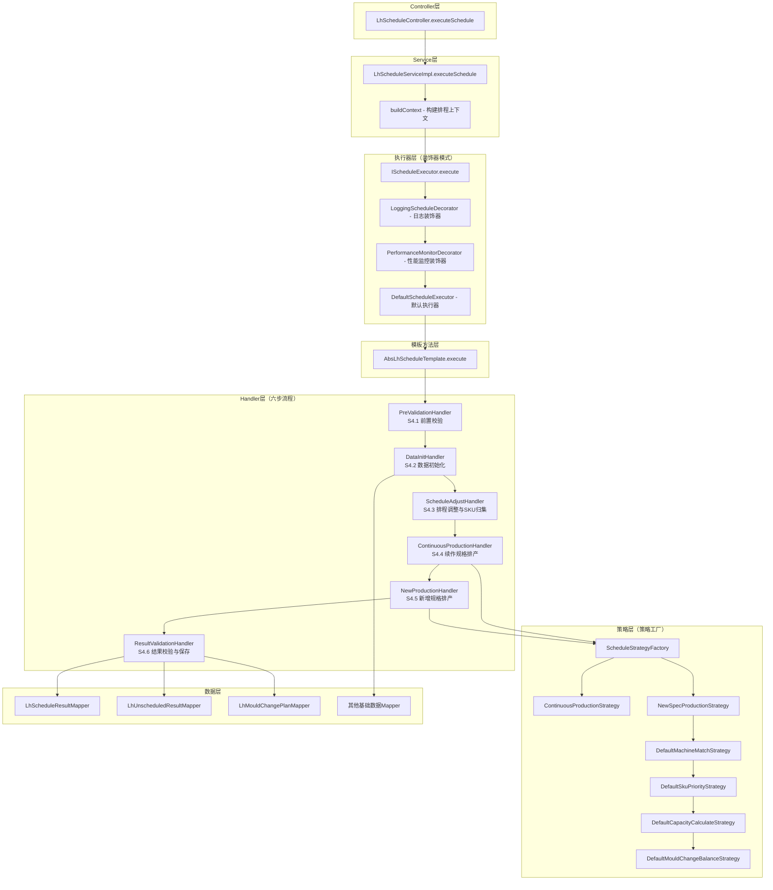

# 硫化排程自动排程方法分析报告

## 一、完整调用链路



### 1.1 入口到核心层调用流程

| 层级 | 类/接口 | 方法 | 职责 |
|------|---------|------|------|
| Controller | `LhScheduleController` | executeSchedule | 接收HTTP请求，日志记录，调用Service |
| Service | `LhScheduleServiceImpl` | executeSchedule | 构建Context上下文，委托执行器 |
| Executor | `DefaultScheduleExecutor` | execute | 委托模板方法执行 |
| Template | `AbsLhScheduleTemplate` | execute | 定义六步流程骨架 |

---

## 二、核心六步流程详解

### S4.1 前置校验与数据清理 (PreValidationHandler)

**处理器**: `com.zlt.aps.lh.handler.PreValidationHandler`

| 子步骤 | 方法 | 功能 |
|--------|------|------|
| S4.1.1 | checkMesReleaseStatus | 校验MES下发状态，已发布禁止重排 |
| S4.1.2 | checkScheduleInProgress | 防止重复排程 |
| S4.1.3 | cleanHistoryData | 删除旧排程结果、未排结果、换模计划 |
| S4.1.4 | generateBatchNo | 通过Redis生成批次号(LHPC+yyyyMMdd+流水号) |

### S4.2 基础数据初始化 (DataInitHandler)

**处理器**: `com.zlt.aps.lh.handler.DataInitHandler`

加载数据包括：
- 硫化参数（LhParams）
- 月生产计划（FactoryMonthPlanProductionFinalResult）
- 工作日历（MdmWorkCalendar）
- SKU日硫化产能（MdmSkuLhCapacity）
- 设备停机计划（MdmDevicePlanShut）
- SKU与模具关系（MdmSkuMouldRel）
- 硫化机台信息（LhMachineInfo）
- 模具清洗计划（LhMouldCleanPlan）
- MES在机信息（MdmLhMachineOnlineInfo）
- 硫化定点机台（LhSpecifyMachine）
- 胶囊使用次数（MdmLhRepairCapsule）
- 设备保养计划（MdmDevMaintenancePlan）

### S4.3 排程调整与SKU归集 (ScheduleAdjustHandler)

**处理器**: `com.zlt.aps.lh.handler.ScheduleAdjustHandler`

**核心逻辑**:

1. **欠产调整**: 夜班欠产量追加到T日早班计划量
2. **硫化余量计算**: `余量 = 月计划总量 - 各班次完成量之和`
3. **收尾SKU标注**: `余量 <= 8班总产能` 则标注为收尾
4. **SKU分类**: 续作SKU(MES在机) vs 新增SKU(需换模)

### S4.4 续作规格排产 (ContinuousProductionHandler)

**处理器**: `com.zlt.aps.lh.handler.ContinuousProductionHandler`

**策略**: `com.zlt.aps.lh.engine.strategy.impl.ContinuousProductionStrategy`

| 子步骤 | 功能 |
|--------|------|
| S4.4.1 换活字块排产 | 同胎胚同模具的SKU切换，无需换模 |
| S4.4.2 续作收尾判定 | 判断是否可收尾，设置结束时间 |
| S4.4.3 班次计划量分配 | 按夜→早→中顺序分配 |
| S4.4.4 胎胚库存调整 | 收尾SKU优先占用库存 |
| S4.4.5 降模排产 | 多机台同SKU时，按胶囊使用次数均衡 |

### S4.5 新增规格排产 (NewProductionHandler)

**处理器**: `com.zlt.aps.lh.handler.NewProductionHandler`

**策略**: `com.zlt.aps.lh.engine.strategy.impl.NewSpecProductionStrategy`

**核心流程**（遍历每个新增SKU）:
1. SKU优先级排序 (ISkuPriorityStrategy)
2. 匹配候选机台 (IMachineMatchStrategy)
3. 选择最优机台
4. 换模均衡校验 (IMouldChangeBalanceStrategy)
5. 分配换模班次
6. 分配首检时间 (IFirstInspectionBalanceStrategy)
7. 计算开产时间 (ICapacityCalculateStrategy)
8. 按班次分配计划量

### S4.6 结果校验与保存 (ResultValidationHandler)

**处理器**: `com.zlt.aps.lh.handler.ResultValidationHandler`

| 子步骤 | 功能 |
|--------|------|
| S4.6.1 后置校验 | 检查结果完整性 |
| S4.6.2 生成模具交替计划 | 换模机台生成交替计划 |
| S4.6.3 补全工单号 | LHGD+yyyyMMdd+流水号 |
| S4.6.4 保存数据库 | 排程结果、未排结果、换模计划、日志 |
| S4.6.5 发布事件 | 观察者模式通知排程完成 |

---

## 三、关键业务逻辑点

### 3.1 排程约束规则

| 约束类型 | 规则描述 | 实现位置 |
|----------|----------|----------|
| 机台寸口约束 | SKU英寸必须在机台寸口范围内 | `DefaultMachineMatchStrategy.isInchInRange()` |
| 模数约束 | SKU模数不超过机台最大模台数 | `DefaultMachineMatchStrategy.isMouldCompatible()` |
| 共用模保护 | 模具不能被多个机台同时使用 | `DefaultMachineMatchStrategy.getOccupiedMouldCodes()` |
| 定点机台限制 | 某些规格只能在指定机台生产 | `DefaultMachineMatchStrategy.getAllowedMachineCodes()` |
| MES发布约束 | 已发布MES的排程不可重新排产 | `PreValidationHandler.checkMesReleaseStatus()` |

### 3.2 排产优先级算法

**策略**: `com.zlt.aps.lh.engine.strategy.impl.DefaultSkuPriorityStrategy`

```
优先级排序（从高到低）:
1. 有发货要求优先 (deliveryLocked=true)
2. 延误天数越多越优先 (delayDays降序)
3. 收尾SKU优先；收尾日越晚越先上机
4. 供应链优先级：高优先级(04) → 周期排产(05) → 中优先级(06) → 搭配排产(07)
```

**代码实现**:
```java
Comparator<SkuScheduleDTO> comparator = Comparator
    // 顺序1：有发货要求的优先
    .comparingInt((SkuScheduleDTO s) -> s.isDeliveryLocked() ? 0 : 1)
    // 顺序2：延误天数越多越优先
    .thenComparingInt((SkuScheduleDTO s) -> -s.getDelayDays())
    // 顺序3：收尾SKU优先
    .thenComparingInt((SkuScheduleDTO s) -> isEnding(s) ? 0 : 1)
    .thenComparingInt((SkuScheduleDTO s) -> -s.getEndingDaysRemaining())
    // 顺序4：供应链优先级权重
    .thenComparingInt(this::getSupplyChainPriorityOrder);
```

### 3.3 机台匹配逻辑

**策略**: `com.zlt.aps.lh.engine.strategy.impl.DefaultMachineMatchStrategy`

**匹配流程**:
1. 从定点机台Map获取SKU可用机台集合
2. 获取SKU的模具号列表
3. 过滤候选机台：状态启用 + 寸口匹配 + 模具兼容
4. **多维度排序**:
   - 同规格优先
   - 收尾时间升序（早收尾早上机）
   - 收尾时间±20分钟内：相同英寸 > 相近英寸 > 胶囊共用性好

**排序代码**:
```java
candidates.sort(
    // 同规格优先
    Comparator.comparingInt((MachineScheduleDTO m) -> 
        sku.getSpecCode() != null && sku.getSpecCode().equals(m.getPreviousSpecCode()) ? 0 : 1)
    // 收尾时间升序
    .thenComparing((m1, m2) -> {
        // 容差范围内视为相同
        if (LhScheduleTimeUtil.withinTolerance(t1, t2, toleranceMinutes)) {
            return 0;
        }
        return t1.compareTo(t2);
    })
    // 相同英寸优先
    .thenComparingInt(m -> isSameInch(skuInch, parseInch(m.getPreviousProSize())) ? 0 : 1)
    // 英寸差距最小优先
    .thenComparingDouble(m -> calcInchDistance(skuInch, parseInch(m.getPreviousProSize())))
    // 胶囊使用次数少优先
    .thenComparingInt(MachineScheduleDTO::getCapsuleUsageCount)
);
```

### 3.4 产能计算逻辑

**策略**: `com.zlt.aps.lh.engine.strategy.impl.DefaultCapacityCalculateStrategy`

| 计算项 | 公式 | 说明 |
|--------|------|------|
| **班产能** | `(班次时间秒数 / 硫化时间秒数) * 模数` | 标准班次8小时=28800秒 |
| **日产能** | `(24 * 3600 / 硫化时间) * 模数` | 24小时连续生产 |
| **首班产量** | `(首班可用时间 / 硫化时间) * 模数` | 考虑开产时间偏移 |
| **开产时间** | `MAX(基础开产时间, 保养后时间, 维修后时间)` | 取三者最大值 |

**换模时间计算**:

```
换模总耗时 = 换模预热(4h) + 其他作业(4h) = 8h
开产时间 = 前规格收尾时间 + 换模总耗时(8h) + 首检时间(1h)
```

**代码实现**:

```java
@Override
public int calculateShiftCapacity(int lhTimeSeconds, int mouldQty) {
    if (lhTimeSeconds <= 0 || mouldQty <= 0) {
        return 0;
    }
    int shiftSeconds = LhScheduleConstant.SHIFT_DURATION_HOURS * 3600;
    return (shiftSeconds / lhTimeSeconds) * mouldQty;
}

@Override
public Date calculateStartTime(LhScheduleContext context, String machineCode, Date endingTime) {
    // 基础开产时间 = 前SKU收尾时间 + 换模含预热时间
    int mouldChangeTotalHours = LhScheduleTimeUtil.getMouldChangeTotalHours(context);
    Date baseStartTime = LhScheduleTimeUtil.addHours(endingTime, mouldChangeTotalHours);
    
    // 取三者最大值
    Date maintenanceStartTime = calculateMaintenanceStartTime(context, machineCode);
    Date repairStartTime = calculateRepairStartTime(context, machineCode);
    
    Date maxStartTime = baseStartTime;
    if (maintenanceStartTime != null && maintenanceStartTime.after(maxStartTime)) {
        maxStartTime = maintenanceStartTime;
    }
    if (repairStartTime != null && repairStartTime.after(maxStartTime)) {
        maxStartTime = repairStartTime;
    }
    return maxStartTime;
}
```

### 3.5 【重点】计划量分配到各班次逻辑

**核心方法**: `ContinuousProductionStrategy.distributeToShifts()`

**班次时间窗口**（8个班次，覆盖3天）:

| 班次索引 | 时间范围 | 所属日期 | 班次类型 |
|----------|----------|----------|----------|
| 1班 | 06:00-14:00 | T日 | 早班 |
| 2班 | 14:00-22:00 | T日 | 中班 |
| 3班 | 22:00-06:00 | T+1日 | 夜班 |
| 4班 | 06:00-14:00 | T+1日 | 早班 |
| 5班 | 14:00-22:00 | T+1日 | 中班 |
| 6班 | 22:00-06:00 | T+2日 | 夜班 |
| 7班 | 06:00-14:00 | T+2日 | 早班 |
| 8班 | 14:00-22:00 | T+2日 | 中班 |

**分配算法**:
```java
private int distributeToShifts(LhScheduleResult result,
                               List<LhScheduleTimeUtil.ShiftInfo> shifts,
                               Date startTime,
                               int lhTimeSeconds,
                               int mouldQty,
                               int remaining) {
    if (lhTimeSeconds <= 0 || mouldQty <= 0 || remaining <= 0) {
        return remaining;
    }

    boolean started = false;
    for (LhScheduleTimeUtil.ShiftInfo shift : shifts) {
        if (remaining <= 0) {
            break;
        }
        
        // 找到开始班次
        if (!started) {
            if (startTime != null && !startTime.before(shift.getEndTime())) {
                continue;
            }
            started = true;
        }

        // 计算该班次可用时间
        Date effectiveStart = (startTime != null && startTime.after(shift.getStartTime()))
                ? startTime : shift.getStartTime();
        long availableSeconds = (shift.getEndTime().getTime() - effectiveStart.getTime()) / 1000L;
        
        if (availableSeconds <= 0) {
            continue;
        }

        // 班次最大产能 = (可用时间/硫化时间) * 模数
        int shiftMaxQty = (int) (availableSeconds / lhTimeSeconds) * mouldQty;
        int shiftQty = Math.min(remaining, shiftMaxQty);

        setShiftPlanQty(result, shift.getShiftIndex(), shiftQty, effectiveStart, shift.getEndTime());
        remaining -= shiftQty;
        startTime = null; // 后续班次从班次开始时间算起
    }
    return remaining;
}
```

```java
// 伪代码描述
for (班次 shift : 班次列表) {
    if (剩余量 <= 0) break;
    

    // 计算该班次可用时间
    可用秒数 = shift.结束时间 - max(开产时间, shift.开始时间);
    
    // 计算该班次最大产能
    班次最大量 = (可用秒数 / 硫化时间秒数) * 模数;
    
    // 分配量 = min(剩余量, 班次最大量)
    分配量 = Math.min(剩余量, 班次最大量);
    
    设置班次计划量(shift索引, 分配量);
    剩余量 -= 分配量;

}
```


### 3.6 换模均衡控制

**策略**: `com.zlt.aps.lh.engine.strategy.impl.DefaultMouldChangeBalanceStrategy`

| 约束项 | 限制值 | 说明 |
|--------|--------|------|
| 每日换模上限 | 15台 | 全厂每天最多换模次数 |
| 早班换模上限 | 8台 | 06:00-14:00时段 |
| 中班换模上限 | 7台 | 14:00-22:00时段 |
| 夜班换模上限 | 0台 | 22:00-06:00禁止换模 |
| 禁止换模时段 | 20:00 - 次日06:00 | 包含夜班和中班后半段 |

**均衡分配逻辑**:
```java
@Override
public Date allocateMouldChange(LhScheduleContext context, Date endingTime) {
    Date adjustedTime = endingTime;
    
    for (int dayOffset = 0; dayOffset < 5; dayOffset++) {
        // 若在禁止换模时间段内，延后到次日早班
        if (LhScheduleTimeUtil.isNoMouldChangeTime(context, adjustedTime)) {
            adjustedTime = getNextMorningShiftStart(context, adjustedTime);
        }

        String dateKey = formatDateKey(adjustedTime);
        int[] counts = context.getDailyMouldChangeCountMap()
            .computeIfAbsent(dateKey, k -> new int[]{0, 0});

        if (LhScheduleTimeUtil.isMorningShift(context, adjustedTime)) {
            if (counts[IDX_MORNING] < morningLimit) {
                counts[IDX_MORNING]++;
                return adjustedTime;
            }
            // 早班已满，延后到中班
            adjustedTime = LhScheduleTimeUtil.getAfternoonShiftStart(context, adjustedTime);
            continue;
        }

        if (LhScheduleTimeUtil.isAfternoonShift(context, adjustedTime)) {
            if (counts[IDX_AFTERNOON] < afternoonLimit) {
                counts[IDX_AFTERNOON]++;
                return adjustedTime;
            }
            // 中班也满了，延后到次日早班
            adjustedTime = getNextMorningShiftStart(context, adjustedTime);
            continue;
        }

        // 夜班不换模
        adjustedTime = getNextMorningShiftStart(context, adjustedTime);
    }
    return null;
}
```

---

## 四、系统作用与架构价值

### 4.1 核心作用

该方法是**硫化排程系统的核心入口**，承载了以下关键业务能力：

| 能力维度 | 描述 |
|----------|------|
| **T日模型** | 以目标日为核心，向前推算排程窗口（3天8班次） |
| **续作优先** | 优先保障在产SKU的连续性，减少换模次数 |
| **产能最大化** | 通过班次分配算法，充分利用每个班次的可用时间 |
| **约束满足** | 机台匹配、模具共用、定点机台等多重约束综合考量 |
| **可追溯性** | 批次号机制支持排程版本管理与历史追溯 |

### 4.2 设计模式应用

| 模式 | 应用位置 | 作用 |
|------|----------|------|
| **模板方法** | `AbsLhScheduleTemplate` | 定义六步流程骨架，保证执行顺序 |
| **策略模式** | 各种Strategy接口 | 算法可替换，支持不同排产策略 |
| **装饰器模式** | `ScheduleExecutorDecorator` | 日志、性能监控等横切关注点 |
| **观察者模式** | `ScheduleEventPublisher` | 排程完成事件通知 |
| **工厂模式** | `ScheduleStrategyFactory` | 统一创建和管理策略对象 |
| **责任链模式** | `DataValidationChain` | 数据校验链式处理 |

### 4.3 关键配置参数

**常量类**: `com.zlt.aps.lh.api.constant.LhScheduleConstant`

| 参数名 | 默认值 | 说明 |
|--------|--------|------|
| SCHEDULE_DAYS | 3 | 排程天数 |
| TOTAL_SHIFTS | 9 | 总班次数（3天×3班） |
| SHIFT_DURATION_HOURS | 8 | 每班时长 |
| MOULD_CHANGE_TOTAL_HOURS | 8 | 换模总耗时 |
| MOULD_CHANGE_PREHEAT_HOURS | 4 | 换模预热时间 |
| FIRST_INSPECTION_HOURS | 1 | 首检时间 |
| FIRST_INSPECTION_QTY | 2 | 首检数量 |
| DEFAULT_DAILY_MOULD_CHANGE_LIMIT | 15 | 每日换模上限 |
| DEFAULT_MORNING_MOULD_CHANGE_LIMIT | 8 | 早班换模上限 |
| DEFAULT_AFTERNOON_MOULD_CHANGE_LIMIT | 7 | 中班换模上限 |
| CAPSULE_FORCE_DOWN_COUNT | 450 | 胶囊强制下机次数 |
| MAINTENANCE_DURATION_HOURS | 7 | 保养耗时 |
| DEFAULT_ENDING_DAYS | 3 | 收尾判定天数 |

---

## 五、类图结构

```
┌─────────────────────────────────────────────────────────────────┐
│                        Controller Layer                          │
├─────────────────────────────────────────────────────────────────┤
│  LhScheduleController                                            │
│  ├── executeSchedule(LhScheduleRequestDTO): LhScheduleResponseDTO│
│  └── publishSchedule(batchNo): LhScheduleResponseDTO            │
└─────────────────────────────────────────────────────────────────┘
                              │
                              ▼
┌─────────────────────────────────────────────────────────────────┐
│                         Service Layer                            │
├─────────────────────────────────────────────────────────────────┤
│  ILhScheduleService                                              │
│  └── LhScheduleServiceImpl                                       │
│      ├── executeSchedule(request)                                │
│      └── publishSchedule(batchNo)                                │
└─────────────────────────────────────────────────────────────────┘
                              │
                              ▼
┌─────────────────────────────────────────────────────────────────┐
│                       Executor Layer (Decorator)                 │
├─────────────────────────────────────────────────────────────────┤
│  IScheduleExecutor                                               │
│  ├── LoggingScheduleDecorator                                    │
│  ├── PerformanceMonitorDecorator                                 │
│  └── DefaultScheduleExecutor                                     │
└─────────────────────────────────────────────────────────────────┘
                              │
                              ▼
┌─────────────────────────────────────────────────────────────────┐
│                       Template Layer                             │
├─────────────────────────────────────────────────────────────────┤
│  AbsLhScheduleTemplate                                           │
│  └── execute(context) - 模板方法，定义六步流程                   │
└─────────────────────────────────────────────────────────────────┘
                              │
                              ▼
┌─────────────────────────────────────────────────────────────────┐
│                        Handler Layer                             │
├─────────────────────────────────────────────────────────────────┤
│  AbsScheduleStepHandler                                          │
│  ├── PreValidationHandler (S4.1)                                 │
│  ├── DataInitHandler (S4.2)                                      │
│  ├── ScheduleAdjustHandler (S4.3)                                │
│  ├── ContinuousProductionHandler (S4.4)                          │
│  ├── NewProductionHandler (S4.5)                                 │
│  └── ResultValidationHandler (S4.6)                              │
└─────────────────────────────────────────────────────────────────┘
                              │
                              ▼
┌─────────────────────────────────────────────────────────────────┐
│                        Strategy Layer                            │
├─────────────────────────────────────────────────────────────────┤
│  ScheduleStrategyFactory                                         │
│  ├── IProductionStrategy                                         │
│  │   ├── ContinuousProductionStrategy                            │
│  │   └── NewSpecProductionStrategy                               │
│  ├── IMachineMatchStrategy → DefaultMachineMatchStrategy         │
│  ├── ISkuPriorityStrategy → DefaultSkuPriorityStrategy           │
│  ├── ICapacityCalculateStrategy → DefaultCapacityCalculateStrategy│
│  ├── IMouldChangeBalanceStrategy → DefaultMouldChangeBalanceStrategy│
│  └── IFirstInspectionBalanceStrategy → DefaultFirstInspectionBalanceStrategy│
└─────────────────────────────────────────────────────────────────┘
```

---

## 六、总结

`executeSchedule` 方法是硫化排程系统的**总调度入口**，通过**六步Handler流程**和**多种策略模式**的组合，实现了：

1. **自动化排产**：从月计划自动生成每日每班次的排程计划
2. **智能匹配**：综合考虑机台寸口、模具共用、定点机台等约束
3. **产能优化**：通过班次分配算法最大化利用产能
4. **业务合规**：满足换模均衡、首检分配、胎胚库存等业务规则
5. **可扩展性**：策略模式支持算法灵活替换和扩展

---

*报告生成时间: 2026年4月2日*
